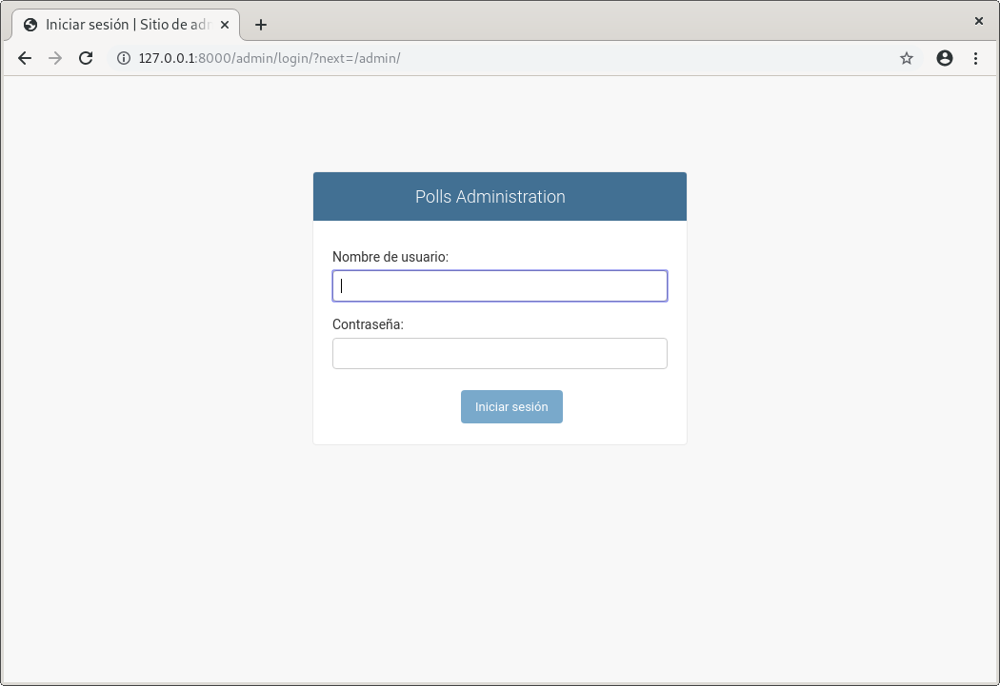
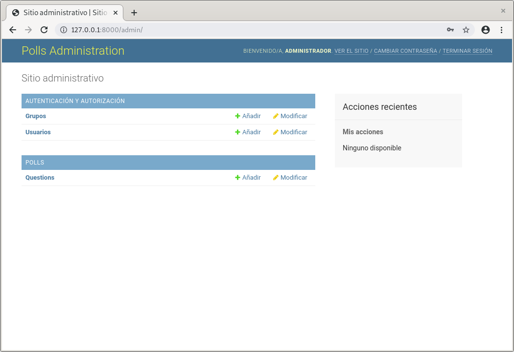
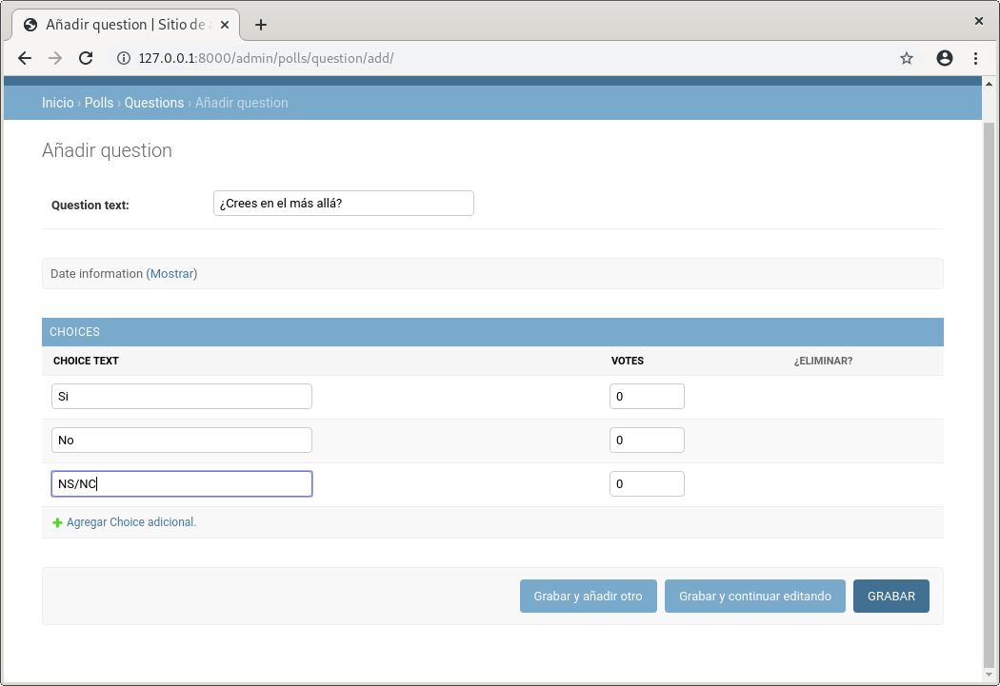
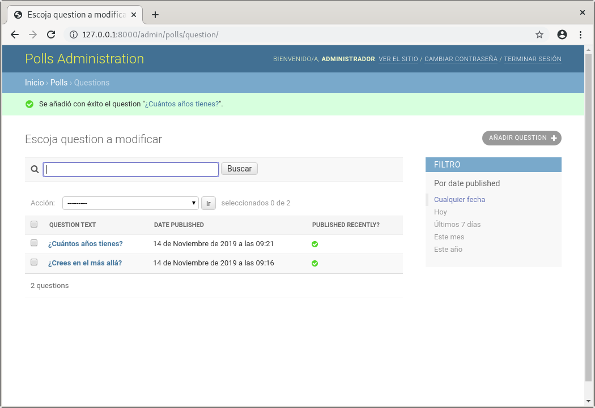
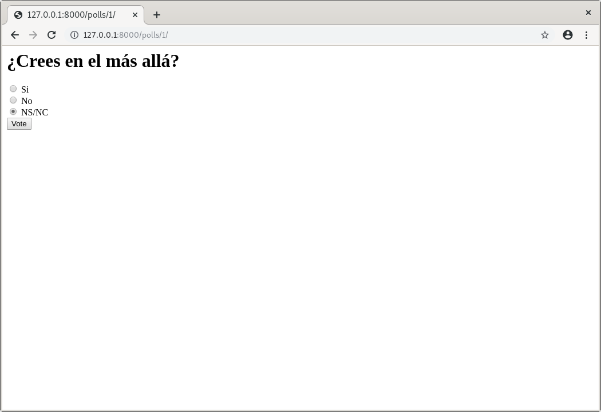
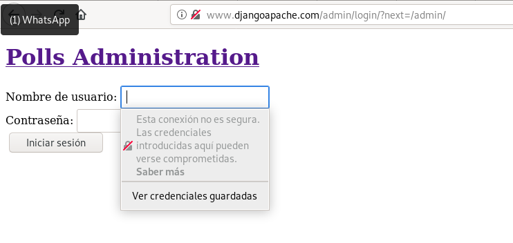
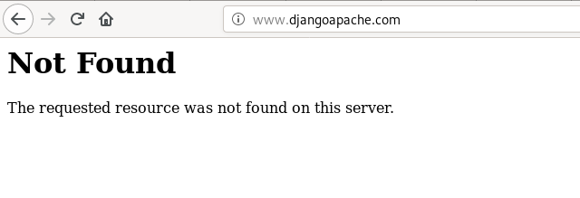
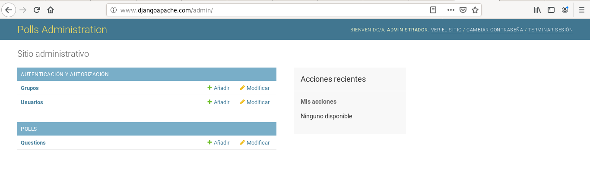
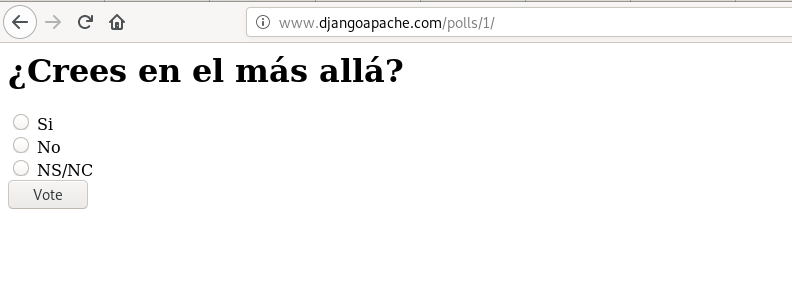

# Introducción al despliegue de aplicaciones python
## Tarea 1: Entorno de desarrollo
Vamos a desarrollar la aplicación del tutorial de django 2.1. Vamos a configurar tu equipo como entorno de desarrollo para trabajar con la aplicación, para ello:

- Clona el repositorio de GitHub: [django_tutorial](https://github.com/josedom24/django_tutorial).
~~~
paloma@coatlicue:~/DISCO2/CICLO II/SERVICIO DE RED E INTERNET/Practica_Apache2$ git clone https://github.com/josedom24/django_tutorial.git
~~~

- Crea un entorno virtual de python3 e instala las dependencias necesarias para que funcione el proyecto (fichero requirements.txt).
Descargar el paquete que permite crear entornos en python.
~~~
paloma@coatlicue:~/DISCO2/CICLO II/SERVICIO DE RED E INTERNET/Practica_Apache2$ sudo apt install python3-venv
~~~

Se crea el entorno:
~~~
paloma@coatlicue:~/DISCO2/CICLO II/SERVICIO DE RED E INTERNET/Practica_Apache2$ python3 -m venv django
~~~

Activar el entorno:
~~~
paloma@coatlicue:~/DISCO2/CICLO II/IMPLANTACIÓN DE APLICACIONES WEB/Introd
uccion_al_despliegue_de_aplicaciones_python$ source django/bin/activate
~~~

Se instalan todos los paquetes que se indican en el fichero requirements que se ha clonado de gitHub. 
~~~
(django) paloma@coatlicue:~/DISCO2/CICLO II/IMPLANTACIÓN DE APLICACIONES W
EB/Introduccion_al_despliegue_de_aplicaciones_python/django_tutorial$ pip install -r requirements.txt
~~~

- Comprueba que vamos a trabajar con una base de datos sqlite (django_tutorial/settings.py). ¿Cómo se llama la base de datos que vamos a crear?

Las opciones que se indican en **django_tutorial/settings.py** son:
~~~ 
DATABASES = {
    'default': {
        'ENGINE': 'django.db.backends.sqlite3',
        'NAME': os.path.join(BASE_DIR, 'db.sqlite3'),
    }
}
~~~

El fichero que se crea es db.sqlite3.

- Crea la base de datos: python3 manage.py migrate. A partir del modelo de datos se crean las tablas de la base de datos.
~~~
(django) paloma@coatlicue:~/DISCO2/CICLO II/IMPLANTACIÓN DE APLICACIONES W
EB/Introduccion_al_despliegue_de_aplicaciones_python/django_tutorial$ python3 manage.py migrate
~~~

- Crea un usuario administrador: python3 manage.py createsuperuser.
~~~
(django) paloma@coatlicue:~/DISCO2/CICLO II/IMPLANTACIÓN DE APLICACIONES W
EB/Introduccion_al_despliegue_de_aplicaciones_python/django_tutorial$ python3 manage.py createsuperuser
Nombre de usuario (leave blank to use 'paloma'): administrador
Dirección de correo electrónico: palomagarciacampon08@gmail.com
Password: 
Password (again): 
Superuser created successfully.
~~~

- Ejecuta el servidor web de desarrollo y entra en la zona de administración (\admin) para comprobar que los datos se han añadido correctamente.
Se ejecuta el servidor web:
~~~
(django) paloma@coatlicue:~/DISCO2/CICLO II/IMPLANTACIÓN DE APLICACIONES W
EB/Introduccion_al_despliegue_de_aplicaciones_python/django_tutorial$ python manage.py runserver
Watching for file changes with StatReloader
Performing system checks...

System check identified no issues (0 silenced).
November 14, 2019 - 09:07:55
Django version 2.2.7, using settings 'django_tutorial.settings'
Starting development server at http://127.0.0.1:8000/
Quit the server with CONTROL-C.
~~~

En la dirección se se indica aparecerá la ip corespndiente en la dirección admin/. Hay que logearse con el usuario que se ha creado anteriormente para ver que ha funcionado correctamente.

- Crea dos preguntas, con posibles respuestas.

En la aplicación se selecciona añadir Questions y se rellenan los datos correspondientes para agregar las preguntas:

- Comprueba en el navegador que la aplicación está funcionando, accede a la url \polls.

## Tarea 2: Entorno de producción

Vamos a realizar el despliegue de nuestra aplicación en un entorno de producción, para ello vamos a utilizar una instancia del cloud, para ello:

- Instala en el servidor los servicios necesarios (apache2). Instala el módulo de apache2 para ejecutar código python.

Tras crear una máquina Debian Buster en el cloud, se accede a ella y se añaden los siguientes paquetes:
~~~
debian@appython:~$ sudo apt install apache2
debian@appython:/var/www/html/django_tutorial$ sudo apt install libapache2-mod-wsgi-py3
~~~

- Clona el repositorio en el DocumentRoot de tu virtualhost.
~~~
debian@appython:/var/www/html$ sudo apt install git
debian@appython:/var/www/html$ sudo git clone https://github.com/josedom24/django_tutorial
~~~

- En el entorno de producción no vamos a crear un entorno virtual, vamos a instalar django en el sistema con pip:
~~~
apt install python3-pip
~~~

Con el comando pip3 instala la misma versión de django que has utilizado en el entorno de desarrollo.
~~~
debian@appython:/var/www/html/django_tutorial$ sudo pip3 install -r requirements.txt
~~~

- Configura un virtualhost en apache2 con la configuración adecuada para que funcione la aplicación. Accede a la página con un nombre. El punto de entrada de nuestro servidor será django_tutorial/wsgi.py. Es recomendable que sigas este manual: https://docs.djangoproject.com/en/2.1/howto/deployment/wsgi/modwsgi/. También te puede ayudar este artículo: Despliegue de aplicación flask en un servidor LAMP o la primera parte de este otro: Ejecución de script python.

Se modifica el fichero de configuración Apache .conf para añadir la dirección de la aplicación:
~~~
<VirtualHost *:80>
	ServerName www.djangoapache.com
	ServerAdmin webmaster@localhost
	DocumentRoot /var/www/html
	
	ErrorLog ${APACHE_LOG_DIR}/error.log
	CustomLog ${APACHE_LOG_DIR}/access.log combined

	WSGIScriptAlias / /var/www/html/django_tutorial/django_tutorial/wsgi.py
	WSGIDaemonProcess django user=www-data group=www-data processes=5 python-path=/var/www/html/django_tutorial
	<Directory /var/www/html/django_tutorial/django_tutorial>
		WSGIProcessGroup django
		WSGIApplicationGroup %{GLOBAL}
		Require all granted
	</Directory>

</VirtualHost>

~~~

Se cambian los permisos de todo el directorio:
~~~
debian@appython:/var/www/html/django_tutorial$ sudo chown -R www-data:www-data /var/www/html/
~~~

Y se incia Apache2:
~~~
debian@appython:/var/www/html/django_tutorial$ sudo a2ensite 000-default.conf 
Site 000-default already enabled
debian@appython:/var/www/html/django_tutorial$ sudo systemctl restart apache2.service 
~~~

Se modifica setting.py:
~~~
ALLOWED_HOSTS = ['www.djangoapache.com']
~~~

Se inicia Apache:
~~~
debian@appython:/var/www/html/django_tutorial$ sudo systemctl restart apache2.service 
~~~

- Crea la base de datos.
~~~
debian@appython:/var/www/html/django_tutorial$ sudo python3 manage.py migrate
~~~

Se añade las siguientes líneas en el .conf:
~~~
Alias "/static/admin/" "/usr/local/lib/python3.7/dist-packages/django/contrib/admin/static/admin/"
	<Directory /usr/local/lib/python3.7/dist-packages/django/contrib/admin/static/admin/>
		Options +FollowSymLinks
		Require all granted
	</Directory>
~~~

- Crea un usuario administrador.
~~~
debian@appython:/var/www/html/django_tutorial$ sudo python3 manage.py createsuperuser
Nombre de usuario (leave blank to use 'root'): Administrador
Dirección de correo electrónico: palomagarciacampon08@gmail.com	
Password: 
Password (again): 
Superuser created successfully.
~~~

- Desactiva en la configuración (fichero settings.py) el modo debug a False. Para que los errores de ejecución no den información sensible de la aplicación.

Se cambia el valor **DEBUG = TRUE** por **DEBUG = FALSE** en setting.py.

- Muestra la página funcionando.

> Para que se muestra la hoja de estilo, que se encuentra en Django y Apache no lo encuentra en principio, hay que añadir un alias en el .conf
~~~
Alias "/static/admin/" "/usr/local/lib/python3.7/dist-packages/django/contrib/admin/static/admin/"
~~~
